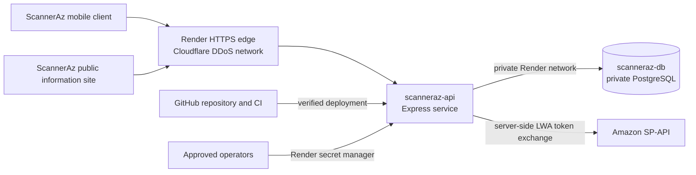

# ScannerAz production architecture

This describes the architecture that is actually deployed for the current
private sandbox validation. It is not evidence that public Amazon seller
connections are enabled.

## Data boundaries

- Amazon refresh tokens, LWA credentials, session secrets, and database URLs
  are server-side Render secrets. They are never bundled into Expo or exposed
  as `EXPO_PUBLIC_*` variables.
- `scanneraz-db` has no public ingress. `scanneraz-api` uses its Render private
  connection URL in the same Oregon region.
- Development and production use separate configuration boundaries. Public
  seller routes remain disabled in production until the Amazon security review
  is completed.

## Current edge and runtime controls

- Render terminates HTTPS and redirects HTTP to HTTPS for public web services.
- Render places inbound traffic behind its Cloudflare-backed DDoS protection.
- The application adds Helmet headers, request size limits, route-specific rate
  limits, and no-store cache headers for authentication and Amazon routes.
- Security rejection and rate-limit events include request, Cloudflare, and
  Render trace identifiers without logging credentials, request bodies, or IP
  addresses.

## Controls still required before public launch

- Configure an independently managed WAF rule set and preserve the evidence of
  active rules and alerts. The current `onrender.com` hostname cannot be
  managed in the company's Cloudflare account.
- Configure alert recipients and retain monitoring evidence for edge blocks,
  account abuse, configuration changes, and anomalous errors.
- Complete the runtime/endpoint anti-malware review with the selected hosting
  provider and retain that evidence.
- Enable and record MFA for Amazon, Render, GitHub, domain registrar, and the
  support mailbox.
- Run and record the six-month incident-response tabletop exercise before a
  public Developer Profile resubmission.
