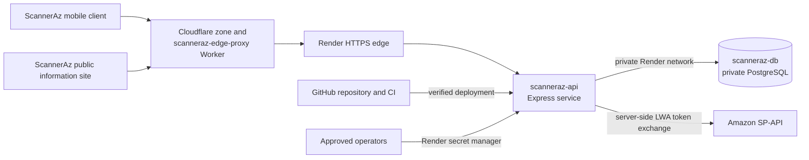

# ScannerAz production architecture

This describes the architecture that is actually deployed for the current
private sandbox validation. It is not evidence that public Amazon seller
connections are enabled.

## Data boundaries

- Amazon refresh tokens, LWA credentials, session secrets, and database URLs
  are server-side Render secrets. They are never bundled into Expo or exposed
  as `EXPO_PUBLIC_*` variables.
- `scanneraz-db` has no public ingress. `scanneraz-api` uses its Render private
  connection URL in the same Oregon region.
- Development and production use separate configuration boundaries. Public
  seller routes remain disabled in production until the Amazon security review
  is completed.

## Current edge and runtime controls

- `scanneraz-edge-proxy` is a Cloudflare Worker with a fixed Render origin;
  it forwards only the original path and query string and cannot be used as an
  open proxy. When its `SCANNERAZ_EDGE_SHARED_SECRET` Worker secret and the
  matching Render secret are configured, the API rejects every direct-origin
  request except Render's health probe. Its deployed source is mirrored in
  `cloudflare/scanneraz-edge-proxy.js`.
- The Worker adds an `X-ScannerAz-Edge: cloudflare` response marker and keeps
  responses non-cacheable when the origin does not state a cache policy.
- `scanneraz.warasoft.com` is the active public hostname for the Worker and
  `APP_BASE_URL` on Render. The temporary `workers.dev` endpoint is disabled.
- The `warasoft.com` zone enforces TLS 1.2 as its minimum version and redirects
  HTTP to HTTPS. It currently uses Cloudflare Free baseline DDoS protection;
  Cloudflare's paid Managed Ruleset is not active.
- The staged Worker source redirects HTTP to HTTPS before forwarding traffic.
  This becomes an active control only after the Worker deployment and
  shared-secret rollout are verified. Render also terminates HTTPS for public
  web services.
- Render places inbound traffic behind its Cloudflare-backed DDoS protection.
- The application adds Helmet headers, request size limits, route-specific rate
  limits, and no-store cache headers for authentication and Amazon routes.
- Security rejection and rate-limit events include request, Cloudflare, and
  Render trace identifiers without logging credentials, request bodies, or IP
  addresses.

## Controls still required before public launch

- Configure an independently managed WAF rule set and preserve the evidence of
  active rules and alerts for `scanneraz.warasoft.com`.
- Configure alert recipients and retain monitoring evidence for edge blocks,
  account abuse, configuration changes, and anomalous errors.
- Complete the runtime/endpoint anti-malware review with the selected hosting
  provider and retain that evidence.
- Enable and record MFA for Amazon, Render, GitHub, domain registrar, and the
  support mailbox.
- Run and record the six-month incident-response tabletop exercise before a
  public Developer Profile resubmission.
